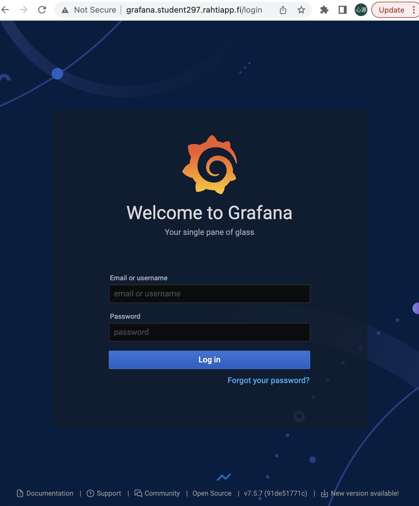
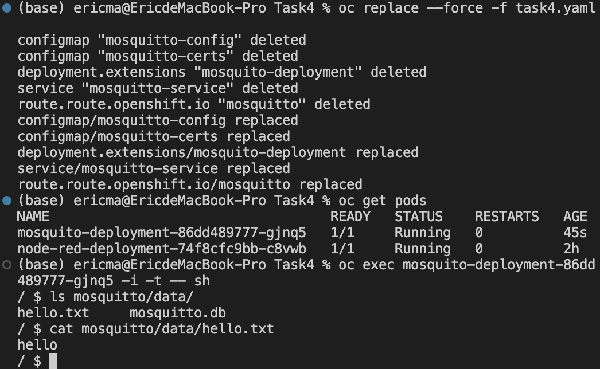
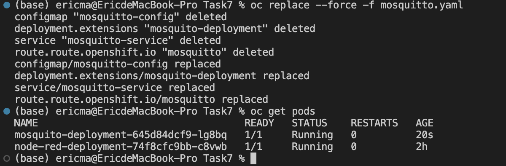
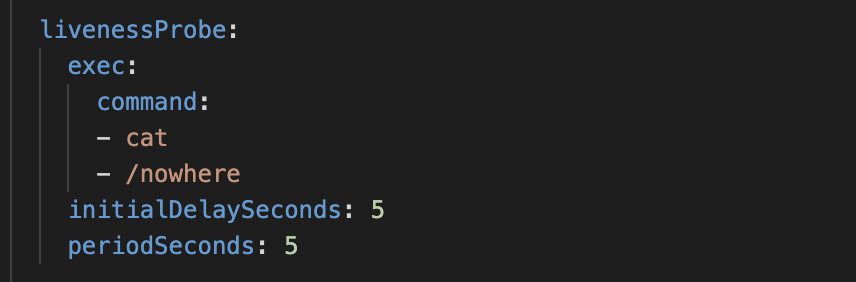
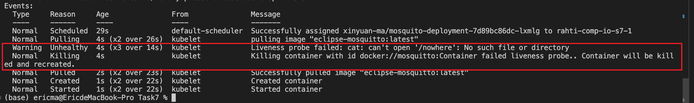
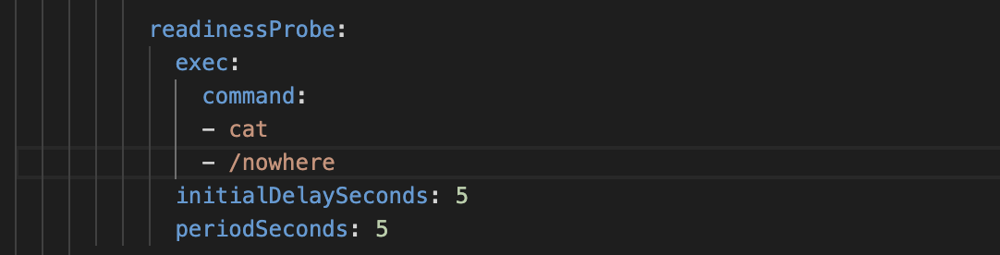
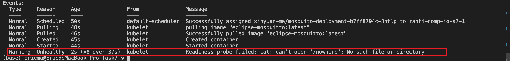

# Final work
## summary
Name: Xinyuan Ma  
student297  

Task 3.1 B - 10pts  
Task 4 - 5pts  
Task 6 - 3pts  
Task 7 - 3pts  

## Task 3.1 B
1. create persistent volumes for Prometheus  
2. create Prometheus yaml file  
3. create persistent volumes for Grafana  
4. create Grafana yaml file  
### screenshot:

## Task 4
Persist MQTT data to a volume
### step:
1. create persistent volumes for MQTT
2. update MQTT yaml file and MQTT config file
### screenshot:

## Task 6
Instead of configMap use secrets to for ca.crt, server.crt and server.key
1. create secrect yaml file
2. update the MQTT yaml file
### screenshot:

## Task 7
Include liveness probe, readiness probe and initial delay for all deployments/deploymentConfigs
### screenshot:
1. start MQTT, everything is fine

2. modify an error path for livenessProbe

3. check the pod status

4. modify an error path for readinessProbe

5. check the pod status

    
## Course Experience:
This course appears to be a bit challenging for me, but I'm glad I made it here.
1. I believe this training is quite useful. It references prominent market situations, integrates extensive industry expertise, and employs the traditional and dependable Kubernetes for practical operation. This course helps students to get a head start on the programming environment and create a solid basis for future work.
2. This training is really hands-on. It strives to help me comprehend and master some applications often used by software engineers, as well as expertise in related subjects. To completely grasp and apply these technologies successfully, you must take the time to assimilate the course material and practice.