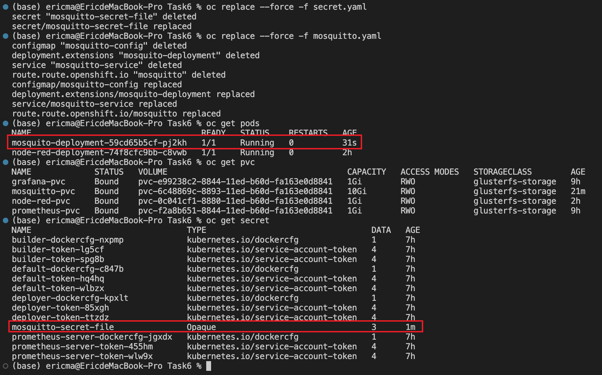

# Final work
## summary
Name: Xinyuan Ma  
student297  

Task 3.1 B - 10pts  
Task 4 - 5pts  
Task 6 - 3pts  
Task 7 - 3pts  

## Task 3.1 B
1. create persistent volumes for Prometheus  
2. create Prometheus yaml file  
3. create persistent volumes for Grafana  
4. create Grafana yaml file  

## Task 4
Persist MQTT data to a volume
### step:
1. create persistent volumes for MQTT
2. update MQTT yaml file and MQTT config file
### screenshot:

## Task 6
Instead of configMap use secrets to for ca.crt, server.crt and server.key
1. create secrect yaml file
2. update the MQTT yaml file
### screenshot:

## Task 7
Include liveness probe, readiness probe and initial delay for all deployments/deploymentConfigs
### screenshot:

